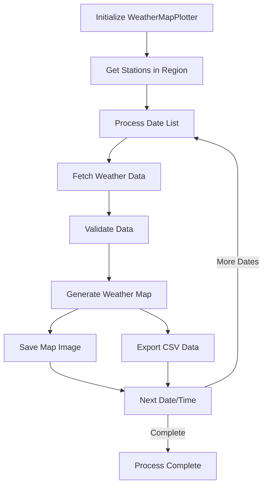

# 🌤️ Weather Map Plotting Module - Technical Documentation

## 📋 Table of Contents

- [Project Overview](#project-overview)
- [Architecture](#architecture)
- [Core Components](#core-components)
- [Data Flow](#data-flow)
- [API Reference](#api-reference)
- [Configuration](#configuration)
- [Installation Guide](#installation-guide)
- [Usage Examples](#usage-examples)
- [Troubleshooting](#troubleshooting)

## 🎯 Project Overview

The Weather Map Plotting Module is a Python application designed to create professional meteorological maps in panson format. The system fetches real-time weather data from meteorological stations and generates visual representations with standardized meteorological symbols.

### Key Features

- **Geospatial Visualization**: Creates 1500x1500px weather maps for a defined region
- **Standard Meteorological Symbols**: Implements panson format compliant with WMO standards
- **Automated Processing**: Generates maps at 3-day intervals for entire years
- **Data Export**: Exports processed weather data to CSV format
- **Extensible Design**: Modular architecture for easy enhancements

## 🏗️ Architecture

```
Weather Map Plotting Module
├── Data Layer
│   ├── Meteostat API Integration
│   ├── Weather Data Processing
│   └── CSV Export Functionality
├── Business Logic Layer
│   ├── WeatherMapPlotter Class
│   ├── Station Data Management
│   └── Date Interval Processing
├── Presentation Layer
│   ├── Map Generation Engine
│   ├── Meteorological Symbol Rendering
│   └── Image Output Management
└── Utility Layer
    ├── Unit Conversion Services
    └── File System Operations
```

## 🧩 Core Components

### WeatherMapPlotter Class

The main class responsible for orchestrating the weather map generation process.

**Key Methods:**
- `get_stations_in_region()`: Retrieves meteorological stations within the defined bounding box
- `get_weather_data_for_datetime()`: Fetches weather data for a specific date and time
- `get_dates_for_year()`: Generates date list at 3-day intervals
- `plot_weather_map()`: Creates visual weather map with panson symbols
- `process_year_data()`: Processes entire year of weather data

### Data Processing Pipeline

1. **Station Discovery**: Identifies meteorological stations within geographic bounds
2. **Data Retrieval**: Fetches T, Td, ff, dd parameters from Meteostat API
3. **Data Validation**: Filters invalid or missing data points
4. **Symbol Generation**: Creates panson symbols using MetPy library
5. **Map Rendering**: Generates high-resolution PNG images
6. **Data Export**: Saves processed data to CSV file

## 🔁 Data Flow



## 📚 API Reference

### WeatherMapPlotter

#### `__init__(self, output_dir='maps')`
Initializes the weather map plotter.

**Parameters:**
- `output_dir` (str): Directory for saving generated maps

#### `get_stations_in_region(self)`
Retrieves list of meteorological stations within defined region.

**Returns:**
- `DataFrame`: List of stations with coordinates and metadata

#### `get_weather_data_for_datetime(self, dt)`
Fetches weather data for all stations at specific datetime.

**Parameters:**
- `dt` (datetime): Target date and time for data retrieval

**Returns:**
- `DataFrame`: Weather data for all stations

#### `plot_weather_map(self, weather_data, dt)`
Creates weather map with panson symbols.

**Parameters:**
- `weather_data` (DataFrame): Processed weather data
- `dt` (datetime): Timestamp for map title

#### `process_year_data(self, year=2025)`
Processes weather data for entire year at 3-day intervals.

**Parameters:**
- `year` (int): Target year for processing

## ⚙️ Configuration

### Geographic Bounds

```python
# Region boundaries for weather map generation
lat_min = 21    # Bottom boundary
lat_max = 34    # Top boundary
lon_min = 110   # Left boundary
lon_max = 120   # Right boundary
```

### Map Specifications

```python
# Map rendering parameters
map_width = 1500    # Pixels
map_height = 1500   # Pixels
dpi = 200           # Resolution for high-quality output
```

### Meteorological Parameters

The system processes four key meteorological parameters:
- **T**: Temperature (°C) - Displayed in NW position, red color
- **Td**: Dew point (°C) - Displayed in SW position, green color
- **ff**: Wind speed (m/s) - Displayed as wind barbs, black color
- **dd**: Wind direction (°) - Integrated in wind barbs

## 🛠️ Installation Guide

### Prerequisites

- Python 3.12
- Virtual environment capability
- Internet access for Meteostat API

### Step-by-Step Installation

1. **Clone Repository**
   ```bash
   git clone <repository-url>
   cd weather_plot_puanson
   ```

2. **Create Virtual Environment**
   ```bash
   python3.12 -m venv venv
   source venv/bin/activate  # Linux/macOS
   # or
   venv\Scripts\activate     # Windows
   ```

3. **Install Dependencies**
   ```bash
   pip install -r requirements.txt
   ```

4. **Verify Installation**
   ```bash
   python -c "import metpy, meteostat, cartopy; print('All dependencies installed successfully')"
   ```

## ▶️ Usage Examples

### Basic Usage

```python
from weather_map_plotter import WeatherMapPlotter
from datetime import datetime

# Initialize plotter
plotter = WeatherMapPlotter()

# Process year 2023 data (testing)
plotter.process_year_data(2023)
```

### Custom Configuration

```python
from weather_map_plotter import WeatherMapPlotter

# Custom output directory
plotter = WeatherMapPlotter(output_dir='custom_maps')

# Process specific year
plotter.process_year_data(2025)
```

### Data Analysis

```python
import pandas as pd

# Load exported weather data
weather_data = pd.read_csv('weather.csv')

# Analyze temperature trends
avg_temp = weather_data['T'].mean()
max_temp = weather_data['T'].max()
min_temp = weather_data['T'].min()

print(f"Average Temperature: {avg_temp:.1f}°C")
print(f"Maximum Temperature: {max_temp:.1f}°C")
print(f"Minimum Temperature: {min_temp:.1f}°C")
```

## 🆘 Troubleshooting

### Common Issues

**1. Missing Dependencies**
```
Error: No module named 'metpy'
```
*Solution: Run `pip install -r requirements.txt`*

**2. Network Connectivity**
```
Error: Unable to fetch data from Meteostat
```
*Solution: Check internet connection and API availability*

**3. Permission Errors**
```
Error: Permission denied when saving maps
```
*Solution: Ensure write permissions for output directory*

### Performance Optimization

- **Memory Management**: Process data in chunks for large datasets
- **API Rate Limiting**: Implement delays between API calls
- **Caching**: Store frequently accessed data locally
- **Parallel Processing**: Use multiprocessing for multiple dates

### Data Quality

- **Validation**: Check for NaN values before plotting
- **Unit Consistency**: Ensure all data uses correct units (m/s for wind speed)
- **Coordinate Accuracy**: Verify station coordinates are within bounds
- **Temporal Consistency**: Ensure data timestamps are correctly formatted

## 📈 Future Enhancements

### Planned Features

1. **Interactive Maps**: Web-based interactive weather maps
2. **Real-time Data**: Live weather data integration
3. **Advanced Visualization**: Isobars, fronts, and other meteorological features
4. **Multi-language Support**: UI localization for international users
5. **Mobile Compatibility**: Responsive design for mobile devices

### Technical Improvements

1. **Asynchronous Processing**: Non-blocking data fetching
2. **Database Integration**: Persistent storage for historical data
3. **API Enhancement**: RESTful interface for external access
4. **Testing Framework**: Comprehensive unit and integration tests
5. **Documentation**: Detailed API documentation and examples

## 📄 License

This project is licensed under the MIT License. See the [LICENSE](LICENSE) file for details.

## 👥 Authors

- **F2re** - *Lead Developer* - Meteorological Data Visualization Specialist

## 🤝 Contributing

We welcome contributions to improve the Weather Map Plotting Module:

1. Fork the repository
2. Create a feature branch
3. Commit your changes
4. Push to the branch
5. Open a pull request

Please ensure your code follows the project's coding standards and includes appropriate tests.