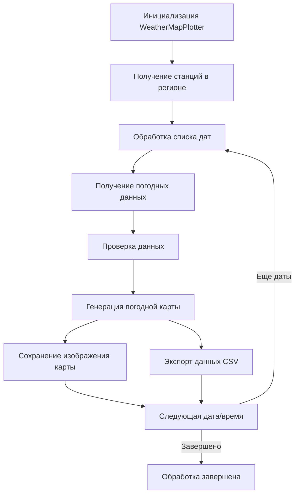

# 🌤️ Модуль построения погодных карт - Техническая документация

## 📋 Содержание

- [Обзор проекта](#обзор-проекта)
- [Архитектура](#архитектура)
- [Основные компоненты](#основные-компоненты)
- [Поток данных](#поток-данных)
- [Справочник API](#справочник-api)
- [Конфигурация](#конфигурация)
- [Руководство по установке](#руководство-по-установке)
- [Примеры использования](#примеры-использования)
- [Устранение неполадок](#устранение-неполадок)

## 🎯 Обзор проекта

Модуль построения погодных карт - это приложение на Python, предназначенное для создания профессиональных метеорологических карт в формате пансонов. Система получает данные о погоде в реальном времени с метеорологических станций и генерирует визуальные представления со стандартизированными метеорологическими символами.

### Ключевые особенности

- **Геопространственная визуализация**: Создает погодные карты размером 1500x1500 пикселей для определенного региона
- **Стандартные метеорологические символы**: Реализует формат пансонов, соответствующий стандартам ВМО
- **Автоматическая обработка**: Генерирует карты с интервалом в 3 дня для целых лет
- **Экспорт данных**: Экспортирует обработанные погодные данные в формат CSV
- **Расширяемая конструкция**: Модульная архитектура для легкого расширения

## 🏗️ Архитектура

```
Модуль построения погодных карт
├── Слой данных
│   ├── Интеграция с API Meteostat
│   ├── Обработка погодных данных
│   └── Функциональность экспорта CSV
├── Слой бизнес-логики
│   ├── Класс WeatherMapPlotter
│   ├── Управление данными станций
│   └── Обработка интервалов дат
├── Слой представления
│   ├── Движок генерации карт
│   ├── Рендеринг метеорологических символов
│   └── Управление выводом изображений
└── Слой утилит
    ├── Сервисы преобразования единиц
    └── Операции с файловой системой
```

## 🧩 Основные компоненты

### Класс WeatherMapPlotter

Основной класс, отвечающий за координацию процесса генерации погодных карт.

**Ключевые методы:**
- `get_stations_in_region()`: Получает метеорологические станции в пределах определенной области
- `get_weather_data_for_datetime()`: Получает погодные данные для конкретной даты и времени
- `get_dates_for_year()`: Генерирует список дат с интервалом в 3 дня
- `plot_weather_map()`: Создает визуальную погодную карту с символами пансонов
- `process_year_data()`: Обрабатывает данные о погоде за целый год

### Конвейер обработки данных

1. **Обнаружение станций**: Определяет метеорологические станции в пределах географических границ
2. **Получение данных**: Извлекает параметры T, Td, ff, dd из API Meteostat
3. **Проверка данных**: Фильтрует недействительные или отсутствующие точки данных
4. **Генерация символов**: Создает символы пансонов с использованием библиотеки MetPy
5. **Рендеринг карт**: Генерирует изображения высокого разрешения в формате PNG
6. **Экспорт данных**: Сохраняет обработанные данные в файл CSV

## 🔁 Поток данных



## 📚 Справочник API

### WeatherMapPlotter

#### `__init__(self, output_dir='maps')`
Инициализирует построитель погодных карт.

**Параметры:**
- `output_dir` (str): Каталог для сохранения сгенерированных карт

#### `get_stations_in_region(self)`
Получает список метеорологических станций в пределах определенного региона.

**Возвращает:**
- `DataFrame`: Список станций с координатами и метаданными

#### `get_weather_data_for_datetime(self, dt)`
Получает погодные данные для всех станций в определенную дату и время.

**Параметры:**
- `dt` (datetime): Целевая дата и время для получения данных

**Возвращает:**
- `DataFrame`: Погодные данные для всех станций

#### `plot_weather_map(self, weather_data, dt)`
Создает погодную карту с символами пансонов.

**Параметры:**
- `weather_data` (DataFrame): Обработанные погодные данные
- `dt` (datetime): Метка времени для заголовка карты

#### `process_year_data(self, year=2025)`
Обрабатывает погодные данные за целый год с интервалом в 3 дня.

**Параметры:**
- `year` (int): Целевой год для обработки

## ⚙️ Конфигурация

### Географические границы

```python
# Границы региона для генерации погодных карт
lat_min = 21    # Нижняя граница
lat_max = 34    # Верхняя граница
lon_min = 110   # Левая граница
lon_max = 120   # Правая граница
```

### Спецификации карт

```python
# Параметры рендеринга карт
map_width = 1500    # Пиксели
map_height = 1500   # Пиксели
dpi = 200           # Разрешение для высококачественного вывода
```

### Метеорологические параметры

Система обрабатывает четыре ключевых метеорологических параметра:
- **T**: Температура (°C) - Отображается в СЗ позиции, красный цвет
- **Td**: Точка росы (°C) - Отображается в ЮЗ позиции, зеленый цвет
- **ff**: Скорость ветра (м/с) - Отображается в виде флагов, черный цвет
- **dd**: Направление ветра (°) - Интегрировано в флаги ветра

## 🛠️ Руководство по установке

### Предварительные требования

- Python 3.12
- Возможность создания виртуальной среды
- Доступ в Интернет для API Meteostat

### Пошаговая установка

1. **Клонирование репозитория**
   ```bash
   git clone <адрес-репозитория>
   cd weather_plot_puanson
   ```

2. **Создание виртуальной среды**
   ```bash
   python3.12 -m venv venv
   source venv/bin/activate  # Linux/macOS
   # или
   venv\Scripts\activate     # Windows
   ```

3. **Установка зависимостей**
   ```bash
   pip install -r requirements.txt
   ```

4. **Проверка установки**
   ```bash
   python -c "import metpy, meteostat, cartopy; print('Все зависимости успешно установлены')"
   ```

## ▶️ Примеры использования

### Базовое использование

```python
from weather_map_plotter import WeatherMapPlotter
from datetime import datetime

# Инициализация построителя
plotter = WeatherMapPlotter()

# Обработка данных за 2023 год (тестирование)
plotter.process_year_data(2023)
```

### Пользовательская конфигурация

```python
from weather_map_plotter import WeatherMapPlotter

# Пользовательский каталог вывода
plotter = WeatherMapPlotter(output_dir='custom_maps')

# Обработка конкретного года
plotter.process_year_data(2025)
```

### Анализ данных

```python
import pandas as pd

# Загрузка экспортированных погодных данных
weather_data = pd.read_csv('weather.csv')

# Анализ тенденций температуры
avg_temp = weather_data['T'].mean()
max_temp = weather_data['T'].max()
min_temp = weather_data['T'].min()

print(f"Средняя температура: {avg_temp:.1f}°C")
print(f"Максимальная температура: {max_temp:.1f}°C")
print(f"Минимальная температура: {min_temp:.1f}°C")
```

## 🆘 Устранение неполадок

### Распространенные проблемы

**1. Отсутствующие зависимости**
```
Ошибка: No module named 'metpy'
```
*Решение: Выполните `pip install -r requirements.txt`*

**2. Подключение к сети**
```
Ошибка: Unable to fetch data from Meteostat
```
*Решение: Проверьте подключение к Интернету и доступность API*

**3. Ошибки разрешений**
```
Ошибка: Permission denied when saving maps
```
*Решение: Убедитесь, что у вас есть права на запись в каталог вывода*

### Оптимизация производительности

- **Управление памятью**: Обработка данных блоками для больших наборов данных
- **Ограничение частоты API**: Реализация задержек между вызовами API
- **Кэширование**: Локальное хранение часто запрашиваемых данных
- **Параллельная обработка**: Использование многопроцессорности для нескольких дат

### Качество данных

- **Проверка**: Поиск значений NaN перед построением графиков
- **Согласованность единиц**: Обеспечение использования правильных единиц (м/с для скорости ветра)
- **Точность координат**: Проверка, что координаты станций находятся в пределах границ
- **Согласованность времени**: Обеспечение правильного форматирования временных меток

## 📈 Будущие улучшения

### Планируемые функции

1. **Интерактивные карты**: Веб-интерфейс для интерактивных погодных карт
2. **Данные в реальном времени**: Интеграция с данными о текущей погоде
3. **Расширенная визуализация**: Изобары, фронты и другие метеорологические особенности
4. **Многоязычная поддержка**: Локализация интерфейса для международных пользователей
5. **Совместимость с мобильными устройствами**: Адаптивный дизайн для мобильных устройств

### Технические улучшения

1. **Асинхронная обработка**: Неблокирующее получение данных
2. **Интеграция с базой данных**: Постоянное хранение исторических данных
3. **Улучшение API**: RESTful интерфейс для внешнего доступа
4. **Тестирование**: Комплексные модульные и интеграционные тесты
5. **Документация**: Подробная документация API и примеры

## 📄 Лицензия

Этот проект лицензирован по лицензии MIT. См. файл [LICENSE](LICENSE) для получения подробной информации.

## 👥 Авторы

- **F2re** - *Ведущий разработчик* - Специалист по визуализации метеорологических данных

## 🤝 Вклад в проект

Мы приветствуем вклад в улучшение модуля построения погодных карт:

1. Сделайте форк репозитория
2. Создайте ветку функций
3. Зафиксируйте изменения
4. Отправьте изменения в ветку
5. Откройте пул-реквест

Убедитесь, что ваш код соответствует стандартам кодирования проекта и включает соответствующие тесты.